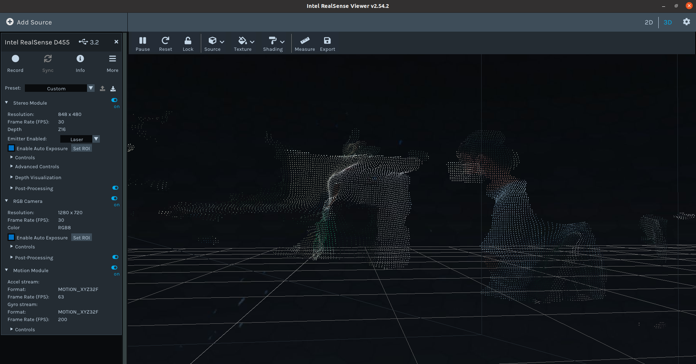
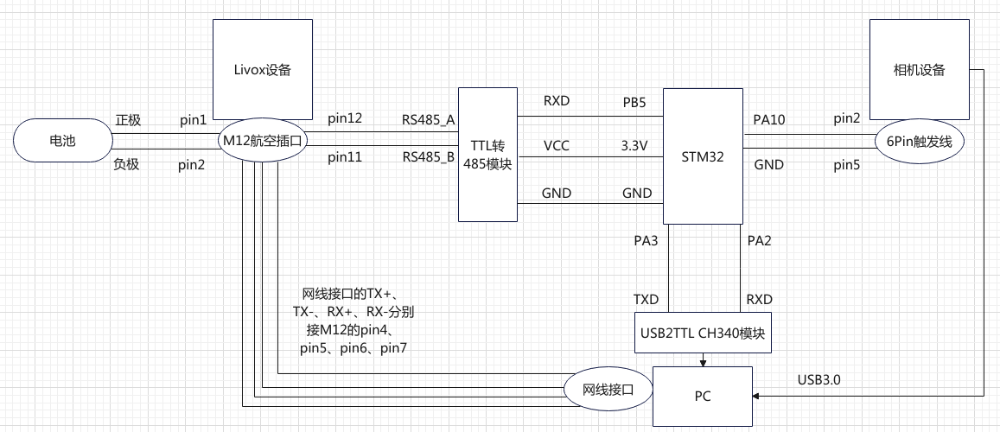
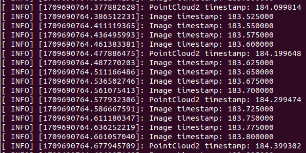
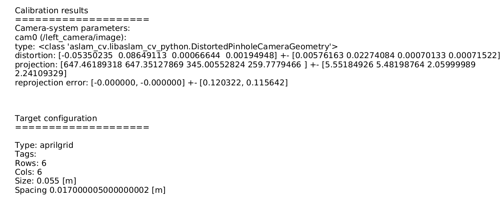
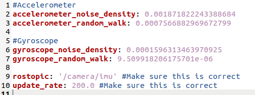
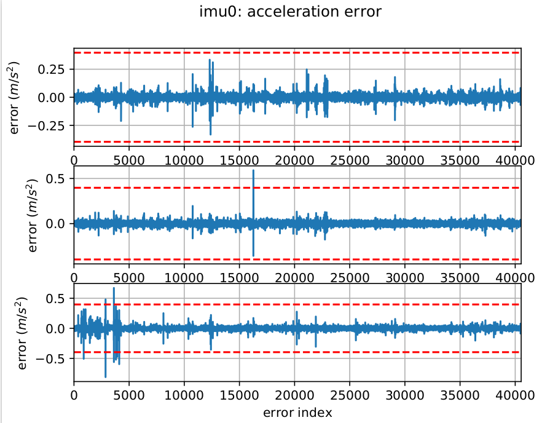

[TOC]

# 运行

```
#启动livox驱动
roslaunch livox_ros_driver livox_lidar.launch 

#启动camera驱动
roslaunch mvs_ros_pkg mvs_camera_trigger.launch

#启动时间同步节点
rosrun sync_camera_lidar sync_camera_lidar_node

#或者，一键启动上面三个节点
#roslaunch boost StartSync.launch
```


# 系统整体框架图


# 硬件接线图


# Livox avia

## 采集数据

- （方法一）使用自带软件Livox Viewer采集数据：（.lvx格式，可在Livox Viewer中查看）


```
启动软件,在路径~/Desktops/LIVOX/Livox_Viewer_For_Linux_Ubuntu16.04_x64_0.10.0下运行：
./livox_viewer.sh
#点播放和录制即可。(只记录了 /livox/lidar 话题，没有IMU话题)
```

注意：启动这个自带软件的时候，会把livox发布的topic占据了，导致后面的ros无法订阅它发布的topic，所以不能同时使用，要先关闭一个。

.lvx格式转化为ros bag文件：

```
#在路径 ~/Desktops/LIVOX/ws_livox下运行：
source devel/setup.bash
roslaunch livox_ros_driver lvx_to_rosbag.launch  lvx_file_path:=".lvx文件目录"
#即可得到.bag文件。
```

- （方法二）使用Livox-SDK采集数据：（.lvx格式，可在Livox Viewer中查看）


参考：https://github.com/Livox-SDK/Livox-SDK/tree/master

```
#在路径 ~/Desktops/LIVOX/Livox-SDK/build/sample/lidar_lvx_file下运行：
./lidar_lvx_sample -c "3JEDK960016Y891" -t 10
#结果：.lvx文件保存在该路径下。(只记录了 /livox/lidar 话题，没有IMU话题)
```

- （方法三）使用 Livox_ros_driver  rviz 录制：（.bag格式）


```
cd ~/Desktops/LIVOX/ws_livox
source ./devel/setup.sh
roslaunch livox_ros_driver livox_lidar_rviz.launch
#注意：要先把设备广播码写到livox_lidar_rviz.launch中的参数值。（<arg name="bd_list" default="3JEDK960016Y891"/>）。或者把广播码写到源代码里面的broadcast_code_list列表，再编译cd build && cmake .. && make && sudo make install 

#会自动打开rviz并自动订阅livox的话题。

#运行以下命令，开始录制bag数据包，存放在本路径下。（可以记录lidar和imu话题）
rosbag record /livox/lidar /livox/imu
```

rviz显示结果：


## 时间软同步

时间同步有硬件同步（GPS）和软件同步（PTP）两种方法。GPS方法精度是微秒，  PTP方法精度是百纳秒。

参考：

https://github.com/Livox-SDK/Livox-SDK/wiki/livox-device-time-synchronization-manual-cn 

https://livox-wiki-cn.readthedocs.io/zh-cn/latest/tutorials/other_product/timestamp_sychronization.html#livox

https://github.com/Livox-SDK/Livox-SDK/wiki/Livox-SDK-Communication-Protocol-Cn

https://livox-wiki-cn.readthedocs.io/zh-cn/latest/tutorials/new_product/common/time_sync.html

https://github.com/BingqiangZhou/LearningSLAM_ROS/blob/main/Files/LivoxLiadarImu_TimeSync.md


### PTP方法

当Livox avia连接到有ptp master时钟的网络（电脑）中时，设备会自动同步自己的时间到主时钟。

连接avia设备后，在自带软件livox_viewer的设置中，看出我的avia没有在使用ptp 1588同步，如下图。


原因：我的电脑网卡不支持硬件时间戳功能(系统硬件不支持PTP)，只能使用软件或系统时钟进行时间戳标记：（见 https://github.com/Livox-SDK/Livox-SDK/wiki/livox-device-time-synchronization-manual-cn#%E9%99%84%E5%BD%95 ）（大量的笔记本电脑的网卡是不支持PTP的。）


- 官网文档：还可以通过查看点云数据包头中的timestamp_type数据来判断是否正在使用PTP同步，但是我发现bag数据包中没有这个字段。所以只能通过自带软件livox_viewer来查看是否正在使用PTP同步。


### GPS方法


参考论文：多传感器融合的球形机器人目标检测跟踪方法

系统中实际使用的传感器具有不同的采样频率。其中，IMU的采样频率为 100Hz，相机的采样频率为 30Hz，毫米波雷达的采样频率为 20Hz。为了让多传感器的数据能够在时间轴上对应，并且保证每一次匹配的数据在时间戳上能尽可能接近对齐，可以采用毫米波雷达采样时间戳为基准，使用ROS信息收发缓存队列缓存图像数据以及IMU数据，在每一帧毫米波雷达数据取得时，对比缓存队列中的数据时间戳以及下一帧的数据时间戳，取距离毫米波雷达数据时间戳最近的图像数据与IMU数据。如图所示，毫米波雷达时间帧与IMU重合，相机取与该时间帧相邻数据中离采样时间最近的一帧数据，最终取得数据为蓝色方框内数据。


# D455相机

### 启动方法

- 方法一：使用自带软件查看

参考：https://github.com/leggedrobotics/realsense-ros-rsl 

```
#使用自带软件，（任何路径）运行：
realsense-viewer
#会自动打开软件，但是没有发布ros话题。
#注意：如果先运行roslaunch文件的话，会占用设备，导致自带软件无法找到设备。所以两种方法只能用一种。

#在自带软件里面可以录制bag包。导出.ply的3D模型。
```

如下：显示原图、深度图、陀螺仪和加速度计。

注意对imu的受力分析：（1）加速度计：imu静止时显示norm为9.8，等于重力加速度，如果做自由落体运动，加速度计的norm就减少到0。（2）陀螺仪：正常拿在手里运动的话norm是5以内，静止的话自然为0。


下面的3D图放大看都是点，并且是可以旋转的三维模型（会有遮挡现象），Raw Point Cloud，每个点都有xyz（单位：米）。并且：距离相机远的地方全黑的，因为探测不到它的深度（大概4m就探测不到了）。（注意相机的三轴坐标系位置）



- 方法二：使用roslaunch文件启动

rs_camera.launch文件有很多可配置的参数，含义见： https://github.com/leggedrobotics/realsense-ros-rsl

```
#使用ros，才可以把相机的信息发布为topic出来。在任何路径下运行：
#roslaunch realsense2_camera rs_camera.launch

#roslaunch realsense2_camera rs_camera.launch filters:=pointcloud enable_gyro:=true enable_accel:=true unite_imu_method:=linear_interpolation serial_no:=046322250468

roslaunch realsense2_camera rs_camera.launch filters:=pointcloud enable_gyro:=true enable_accel:=true unite_imu_method:=linear_interpolation serial_no:=046322250468 enable_infra1:=true enable_infra2:=true enable_sync:=true

//以这种方法修改rs_camera.launch文件里面的参数。
#注意：因为不是源码编译的。要在roslaunch后面附加参数修改，手动改launch文件没用！！！
```


### IMU陀螺仪/加速度计同步

参考：https://blog.csdn.net/weixin_50508111/article/details/123915215

运行 `roslaunch realsense2_camera rs_camera.launch` 后，rostopic list里面没有imu话题。

因为D455的launch文件中，默认关闭imu的话题发布。如下图：


所以运行launch的时候要修改默认参数：

`roslaunch realsense2_camera rs_camera.launch enable_gyro:=true enable_accel:=true`

但是，它默认将陀螺仪和加速计的数据发布为两个互相独立的topic，并且发布频率不一样。（见下图，/camera/accel/sample是63HZ，/camera/gyro/sample是199HZ）


- 既然陀螺仪和加速计的发布频率不一样，就要考虑同步问题：

参考：https://github.com/leggedrobotics/realsense-ros-rsl

https://blog.csdn.net/weixin_50508111/article/details/123915215

https://blog.csdn.net/weixin_46363611/article/details/114643088


rs_camera.launch文件中有一个参数（  <arg name="unite_imu_method" default=""/>），是插值方法。设置其值为“linear_interpolation“或者”copy“，就会创建（public）一个新的topic（/camera/imu），该topic包含同步后的陀螺仪和加速度，并且是以陀螺仪的频率发布的（因为它的频率比较高）。

linear_interpolation方法：将加速计的数据以插值的方式对齐到陀螺仪数据时间轴上。（画个时间轴图看）


 copy方法：在每一个陀螺仪数据上，直接附加上时间最近邻的加速计数据。


运行：

`roslaunch realsense2_camera rs_camera.launch enable_gyro:=true enable_accel:=true unite_imu_method:=linear_interpolation`

或者：

`roslaunch realsense2_camera rs_camera.launch enable_gyro:=true enable_accel:=true unite_imu_method:=copy`

得到“以陀螺仪的频率为基准、对加速度读数插值后“ 所发布的话题 /camera/imu：


查看该话题数据，同时包含陀螺仪和加速度计的数据：


# 海康相机

## 启动方法

相机型号：MV-CV013-21UC

- 方法一：客户端MVS启动

```
#启动客户端软件
sudo -s
cd /opt/MVS/bin && ./MVS
```

- 方法二：ROS驱动启动

ros驱动github源码：https://github.com/luckyluckydadada/HIKROBOT-MVS-CAMERA-ROS

```
#注意：使用ros驱动的话，需要先在客户端中显示图像，然后关闭客户端（避免占用设备），再来这里运行launch文件。

cd ~/Desktops/catkin_ws
source ./devel/setup.bash 
roslaunch hikrobot_camera my_hikrobot_camera.launch
roscore
rviz #订阅topic：/hikrobot_camera/rgb
```


## 相机触发

外触发模式:通过外部给出的信号采集图像。外部信号可以是软件信号，也可以是硬件信号，包含软触发、硬件触发、计数器触发以及自由触发共 4 种方式。

- 软件触发

在客户端软件中，Trigger Mode 参数为 On，Trigger Source为Software，在“开始采集”的状态下，点击软触发的”执行“，即抓拍一张照片。

时序图：触发后，在上升沿处（Trigger_in1）触发,开始曝光，经过一段曝光时间（绿色长度，intergration1）后再开始读出图像（红色长度时间，Frame1 Readout）。如下图：


触发响应方式：相机可以设置在外部信号的上升沿、下降沿、高电平或低电平进行触发采图。注意：不同触发模式下，可选择的触发响应方式有所不同，例如：软触发没得选；硬触发有上升沿下降沿高电平低电平四种方式；技术器有上升沿下降沿两种方式。


# Camera/Lidar硬件时间同步

## 接线方式

### camera接线


注意：stm32的信号线接在pin2，对应管脚是line0+，所以代码里设置触发源为line0：

`nRet = MV_CC_SetEnumValue(handle, "TriggerSource", MV_TRIGGER_SOURCE_LINE0);`

- 客户端调试


如下图，通过STM32给相机线路0（Line0+和Line0-）的pwm波频率为10HZ，所以在上升沿/下降沿触发中，采集帧率为10帧/秒；在高电平/低电平触发中，采集帧率为50帧/秒。


### Livox avia接线


```
source ./devel/setup.sh
roslaunch livox_ros_driver livox_lidar.launch xfer_format:=1
#注意：要先把设备广播码写到livox_lidar.launch中的参数值。（<arg name="bd_list" default="3JEDK960016Y891"/>）。
```

注意：要用usb2ttl连接stm32和电脑，才能有一个串口/dev/ttyUSB0。


## 同步方案一

livox和camera同步前：livox频率只有10hz，海康相机有60hz。


同步前的时序图 ：


同步后希望达到的效果：


参考fast livo的工作 : https://zhuanlan.zhihu.com/p/670136001

fast livo方法的相机和激光雷达的帧头处于相同的物理触发时间。他的imu频率为202hz，相机和livox的频率为10hz并且从0.00s开始第一帧，时间戳stamp完全一致！如下图：


我按照fast livo的方案搭建硬件后，初步效果如下：


出现问题：相机和livox都是10hz，imu的rostopic是206hz，但是rqt看看起来只有10hz。

原因：livox的同步有问题（Open /dev/ttyUSB0 fail!）

解决方法：需要用ttl2usb设备连接stm32和电脑，ttl2usb设备的tx和rx分别接stm32的PA10和PA9。这样的话才能在pc端打开/dev/ttyUSB0设备。该接口向livox发送假的gps消息（gprmc格式，每秒一帧）：

```
#连接ttl2usb设备后，要先给串口权限，才能读取到数据
#sudo usermod -a -G dialout sqhl
sudo chmod a+rw /dev/ttyUSB0
```


livox接收并解析出gprmc数据后，调用 Livox SDK的 LidarSetRmcSyncTime（）函数来设置同步时间。  `$GPRMC,000185.00,A,2237.496474,N,11356.089515,E,0.0,225.5,310518,2.3,W,A*23`

运行 `roslaunch livox_ros_driver livox_lidar.launch` ，GPRMC数据解析成功：


此时的时间戳同步情况：


出现问题：image话题的时间戳全为0，如下图：


原因：共享文件有误，无法正确读取时间戳。

解决方法：修改后，结果如下图，左侧是livox的时间戳，右侧是camera的时间戳，一样的。


出现问题：如下图，livox和camera的时间戳对齐了，但是rqt里面显示的为什么没有竖直对齐？


原因：rosbag录制顺序是数据到来的先后顺序，不是按时间戳排序的。

解决方法：将bag文件中的时间戳进行重新组织和更新，并输出到一个新的bag文件中。最后的效果：


对fast livo的方案提出疑问：不太确定到底同步了没有，因为代码里面是把livox的时间戳写到电脑本地的共享内存文件里，然后camera读取出来后，将其作为image的时间戳发表出去。这样做的话，那图像话题里的时间根本就不是image曝光的时间。


## 同步方案二

```
#启动livox驱动
roslaunch livox_ros_driver livox_lidar.launch 

#启动camera驱动
roslaunch mvs_ros_pkg mvs_camera_trigger.launch

#启动时间同步节点
rosrun sync_camera_lidar sync_camera_lidar_node

#或者，一键启动上面三个节点
roslaunch boost StartSync.launch

#kalibr标定
rosrun kalibr <command_you_want_to_run_here>
rosbag record -O camera_imu111.bag /left_camera/image /livox/imu 
```

- 方案二的系统整体框架图：


图中：$cam里面的时间和触发相机采样的时间是一样的，t2就是相机曝光+出图之后的时间，t1是相机接受到完整$cam的时间，曝光时间设置为20ms（所以最大频率为49，因为20ms*50hz=1S）。

livox同步思路：stm32的定时器time3通过PB5输出1HZ的pwm波（模拟每秒脉冲pps信号），经过TTL转485模块转换电平后，提供给livox的同步信号端口。time1定时器中断函数里输出1HZ的$GPRMC信息到串口，通过USB2TTL模块发送到电脑，然后电脑端在livox驱动里调用livox sdk 设置$GPRMC的时间为当前点云时间戳。即可实现PPS+GPS时间同步方案。

GPS时钟源的PPS端口每秒发送一次硬件脉冲（PPS信号），随后数据端口发送一次对应这个脉冲上升沿的时间信息（GPRMC格式）。Livox设备接收到PPS信号上升沿，并由GPRMC数据解析出正确的时间信息后，会设置点云时间为GPS时间，并保持此时间基准持续累加，来实现和GPS设备的时间同步。Livox LiDAR无法直接接收GPRMC信号，需要将GPRMC数据端口接入PC，然后通过sdk协议发送给雷达。

- 方案二的硬件接线图：（图中TTL转485模块可以用Livox Converter 2.0模块替换）




- livox设置点云时间戳可以通过以下的方案：（在Livox驱动中定义）


```
/** Timestamp sync mode define. */
typedef enum {
  kTimestampTypeNoSync = 0, /**<没有同步信号模式. */
  kTimestampTypePtp = 1,    /**< 1588v2.0 PTP sync mode. */
  kTimestampTypeRsvd = 2,   /**< 保留使用. */
  kTimestampTypePpsGps = 3, /**< pps+gps sync mode. */
  kTimestampTypePps = 4,    /**< 仅 pps sync mode. */
  kTimestampTypeUnknown = 5 /**< Unknown mode. */
} TimestampType;
```

（1）pps+gps模式，就是livox把接受到的GPRMC时间作为当前的时间，例如：接受到`$GPRMC,000005.00,A,2237.496474,N,11356.089515,E,0.0,225.5,310518,2.3,W,A*25` 后，设置当前点云时间戳为000005.00。

（2）仅pps模式：在接收到 GPRMC 字符串 `$GPRMC,000005.00,A,2237.496474,N,11356.089515,E,0.0,225.5,310518,2.3,W,A*25` 后，系统会忽略该数据中的时间信息，而是根据 PPS 信号的触发来进行时间同步。PPS 信号通常以每秒一次的脉冲形式提供，因此系统会将当前时间调整为整秒对应的时间值，而不是直接根据GPRMC数据中的时间信息来设置时间。此时显示的点云时间戳是从设备开机时间开始算起的，与GPRMC中的时间无关。

注意：由于我们使用的GPRMC频率是1hz，所以上面两种方法的效果一样（都是在整秒的时候修正点云时间戳）。但是：我们<u>希望把GPRMC中的时间作为点云时间戳，所以要使用pps+gps模式</u>。


### MCU程序部分

MCU发送两种频率的pwm波：1hz触发livox时间同步（TIM3），40hz触发camera采样（TIM2）。

注意：<u>1hz是一秒钟发送一条gprmc数据给livox做时间基准，而不是让livox一秒采集一帧数据</u>，livox的采集帧率是10hz。

TIM2参考TIM3的配置，能触发一个定时中断，中断里面通过串口发送自定义的视觉参考时间。自定义信息参考GPRMC设计成包头+时间的格式（相机采样时间最低单位是毫秒，因此要用上GPRMC数据中的毫秒部分），如自定义参考时间设计成：

```
$cam, 001020.100
```

包头是$cam，utc时间是00时10分20秒100毫秒

效果：（time2采样频率是40hz，即每隔25ms触发一次中断函数，打印一条cam消息）


如下，rostopic发布出来的相机频率为40hz：


运行结果如下：


出现问题：livox写入共享内存的timestamp为一个，对应camera从共享内存读取的timestamp有4个相同的。即：camera的图像流中，连续4张图像会有相同的时间戳。

原因：livox是1hz，camera原来是10hz，现在改为40hz，所以这里会“连续4张图像会有相同的时间戳“。

解决方法：用rqt记录camera的数据，显示的也是连续4帧的timestmp相同，然后按照时间戳重排序后，4帧相同时间戳的image被整理在一起，1s就有10个4帧（40hz），如下图：


livox 写入共享内存文件的timestamp的频率只是10hz，就是说，一秒钟只更新了10次timestamp，而相机需要一秒钟有40个timestamp，所以会出现上述情况（连续4帧的timestmp相同）。如下图：


### Livox驱动部分

需要改写串口读取的Synchro::ParseGps()函数。改写后的函数可以根据发送过来数据的包头信息判断是相机的真实（触发）时间戳还是GPRMC数据。如果是GPRMC数据，则调用LidarSetRmcSyncTime()函数来修正livox时间。如果是相机时间戳，则通过一个rostopic向相机驱动节点发送`sensor_msgs/TimeReference Message`话题

```
#消息格式参考： https://docs.ros.org/en/noetic/api/sensor_msgs/html/msg/TimeReference.html

std_msgs/Header header.stamp = 当前系统时间（通过ros::Time::now()获得）
time time_ref = 相机的真实时间戳（因为接收到32串口发过来的时间戳才触发相机采样，所以真实时间戳就是32发过来的时间戳）
string source = 相机名称
```

- livox驱动程序的读写操作：


写入操作是指将新的数据包存储到队列（就是缓冲区，先放起来）中的过程。当有新的数据（就是新扫描到手的雷达数据）到达时，会将数据包写入到队列中的某个位置，并更新 `wr_idx` 的值，指示下一个写入的位置。读取操作是指从队列中获取数据包的过程。当需要获取队列中的数据时，会从队列的某个位置读取数据包，并更新 `rd_idx` 的值，指示下一个读取的位置。

出现问题：录制一个数据包，然后按照时间戳重新排序，结果如下图。即：image的时间戳来自stm32发送过来的$cam，而livox的时间戳来自它自己设备开机时间，与stm32无关。明显，这样的时间戳是没办法做同步的。（我先启动livox设备，过了6分钟启动相机，所以图中livox的时间比image快6分钟）


分析原因：livox驱动收到的gprmc格式错误，所以无法解析出来作为/livox/lidar的时间戳。

解决方法：修改stm32端发送的gprmc格式，根据字符串“ $GPRMC,001039.00,A,2237.496474,N,11356.089515,E,0.0,225.5,310518,2.3,W,A* “算出校验位应为2B，然后组成：“ $GPRMC,001039.00,A,2237.496474,N,11356.089515,E,0.0,225.5,310518,2.3,W,A*2B  “发送给livox驱动。这样才能使得livox驱动正确解析并作为自己的时间基准。

结果如下图：


livox端：以stm32的gprmc时间为基准，它的时间精确到纳秒级别；

相机端：因为相机接受到stm32的上升沿后就触发图像，所以时间戳就是32发送过来的$cam，时间精度只有毫秒级别。

### Camera驱动部分

相机节点订阅`sensor_msgs/TimeReference Message`话题(40hz)，并将消息缓存在一个vector<std::pair<double, double>>容器中，前一个double放header中的系统时间，后一个double放相机的真实时间戳。


在相机驱动中，USB口读到一帧图像数据后（MV_CC_GetOneFrameTimeout()函数），根据当前的系统时间在vector<std::pair<double, double>>找到一个系统时间相近的数据（因为传输延时，系统时间不可能完全相同），并为这张图片附上真实时间戳（就是触发采样时间，即32发送过来的 000001.025，000001.050，隔25ms采集一帧）。

参考 https://github.com/leggedrobotics/hardware_time_sync/wiki/1.-Timestamp-Correction

https://github.com/TurtleZhong/Visual-Inertial-Synchronization-Hardware

问题：传感器在触发沿的瞬间开始采集数据，然后再传递到pc，并将pc的接收时间作为该数据的时间戳。但是，从触发采集到达pc有一定的延迟。<u>目标是希望附在image上的时间戳尽可能接近真正触发采集的时间</u>。

解决方法：在livox驱动中，在传感器触发沿的瞬间，记录下pc端的系统时间sys_time1、32串口发过来的时间戳（因为相机接收到32串口发过来的时间戳才触发采样，所以真实触发采样时间戳就是32发过来的时间戳），然后将这些信息通过一个rostopic发送到相机驱动节点。相机节点订阅并接受这个topic的消息，缓存在一个vector<std::pair<double, double>>容器中，前一个double放sys_time1，后一个double放相机的真实触发采样时间戳（就是32串口发过来的时间戳）。当USB口读到一帧image数据后，根据当前的系统时间sys_time2在vector<std::pair<double, double>>找到一个与sys_time1相近的数据（因为传输延时，系统时间不可能完全相同），并为这张image附上真实触发采样时间戳。

即：以pc的系统时间为中介，在sys_time1时刻触发采样image，在sys_time2时刻采集完成并传递到pc。我们要把sys_time1时刻真正的相机采集时间赋值给sys_time2时刻pc收到的image。


### 按时间最近邻做帧对齐

到这里为止，livox发布出来的PointCloud2时间戳就是以stm32的时间为基准，相机发布出来的image时间戳就是stm32给的实际触发时间。接下来就可以同时订阅这两个topic，做时间同步。由于livox是10hz，相机是40hz，所以要以livox帧为准，搜索距离livox帧最近的image帧，对齐起来，并输出对齐后的topic。

方法：使用message_filters::TimerSynchronization函数，把image和livox做同步起来。参考： http://wiki.ros.org/message_filters#Time_Synchronizer

函数解释：Synchronizer过滤器通过消息的head中包含的时间戳同步传入通道，并以使用相同数量通道的单个回调的形式输出它们。 同步器筛选器是在一个策略上模板化的，该策略决定如何同步通道。目前有两种策略：ExactTime和ApproximateTime。

- 函数对齐策略1：message_filters:sync_policies:ExactTime（精确时间同步）（不适合）


要求消息具有完全相同的时间戳才能匹配。只有在所有指定通道上都接收到具有相同确切时间戳的消息时，才会调用回调。时间戳是从所有消息的head字段中读取的。

- 函数对齐策略2：message_filters::sync_policies::ApproximateTime（寻找最接近的时间帧做同步）


根据消息的时间戳,使用自适应算法(http://wiki.ros.org/message_filters/ApproximateTime)匹配消息。如下图，时间从左到右，每一行都是一个话题，每一个点都是一条信息。红色的信息是支点，虚线将这些信息对齐在一起。


开始编写/sync_camera_lidar_node节点，订阅livox和image话题，在这个节点里面使用上面介绍的函数做对齐：


或者：


对齐结果如下图所示：可以看出发布出来的点云的时间和image的时间都是按照stm32的时间为基准的。这种情况就可以实现同步了。




同步效果图：（不需要重新按照时间戳排序，读到的时间就是对齐的时间了。）


接下来,在/sync_camera_lidar_node节点的回调函数里面把这两个同步后的PointCloud2和image发布出来。

结果:发布频率只有10hz，正常的，因为livox的频率就是10hz。只有同时接受到livox和image后，才能把最近的image和它对齐起来。（整个系统被livox的频率限制到了）（可以通过修改livox驱动launch文件，修改发布的lidar话题频率）。如下图所示:


### 触发信号的时序问题

出现一个很奇怪的问题，就是时间戳跟设备的启动顺序有关。
比如之前的启动顺序是：先上电livox和相机、再上电32、然后启动livox和相机的launch文件，就可以同步了。然后现在要添加“相机频率可以在配置文件里改“的功能，就在32里面while等待接受到livox发送的“相机频率”参数后，再初始化time2和time3，所以就需要先给32上电，再启动livox的launch。但是这样的启动顺序的话，livox的点云时间戳就是livox设备的开机时间，而不是32发过来的gprmc时间。而相机时间戳就可以正常使用32的$cam的时间。通信过程测试过，是没有问题的。

经过测试，可以通过 timestamp_type 字段的值判断目前的同步状态：


发现问题：用前面的代码跑起来，timestamp_type一直为4，即：仅在使用pps同步模式。就是说，前面我并没有实现pps+gps同步模式。那为什么前面/sync_camera_lidar_node节点打印出来的lidar和image的时间戳非常接近？如前面的图所示，几乎只有1ms的偏差？

对于这个问题，我做了如下实验测试：借助手机计时，在开始0S的时候上电livox，在40S的时候上电32，在70S的时候开始启动livox的launch文件，结果显示：启动launch文件后采集的第一帧点云的时间戳为30S。得出结论：从上电32开始，livox就接受到1HZ的$gprmc数据，然后使用pps同步模式，把点云的时间戳置0，从头开始计算时间。（pps同步模式会丢掉$gprmc中的时间信息，只利用它的脉冲信息调整点云时间戳。）与此同时，32在上电后也开始发送$cam, 000000.000信息给image做时间戳（也是从0开始算时间）。所以才会看起来“livox和image实现同步”的错觉！画出时间过程图如下：


考虑是否为时序的问题，官网对pps和gprmc信号的波形时序有如下要求：


然后，我用示波器测试这两条信号波形如下：（其中，绿色的pps信号就是stm32的PB5发送出来的，黄色的gprmc信号是stm32的PA9通过串口发送出来的。），可以看出，在9600波特率下，t0为1000ms，t1为200ms，t2为90ms，t3为200ms。除了t2外，其他时间都满足官方时序要求。t2传输gprmc消息的时间比官方推荐值高20ms左右，猜测是这个原因导致无法gps同步。


于是，我把波特率改为115200，结果发现：115200波特率下的gprmc消息传输时间为7ms左右，远远小于官方推荐值70ms（不过，这样比较没有意义，因为官方推荐值是在9600波特率的情况下的。）经过测试后，发现timestamp_type == 4，还是没办法pps+gps同步。

于是，我就用实验室的惯性导航系统来产生gprmc和pps数据。经过测试，timestamp_type == 3，可以成功实现pps+gps时间同步。用示波器看pps波形（黄色，上面）和gprmc波形（绿色，下面）如下，其中：t0为1000ms，t1为100ms，t2为90ms，t3为100ms。同上，t2传输gprmc消息的时间比官方推荐值高20ms左右，但是现在可以实现pps+gps同步，所以排除“由于信号时序不对，导致无法gps+pps同步”的猜测。


接下来，继续寻找原因，看官网的连线方式：“将ttl类型的pps信号接入livox转接盒同步口sync port”。


再看livox avia手册，时间同步信号线有两种连线方式：（1）不使用Converter2.0，livox的M12航空插口的PIN12、PIN11引脚要接pps信号的RS485_A 、RS485_B。即：这种情况，需要用“TTL转RS485模块“将TTL类型的pps的信号转化为RS485信号才能接进去。如下图的上半部分。（2）使用Converter2.0，那插入Converter2.0的同步信号要用3.3V LVTTL电平，如下图的下半部分。


观察出stm32的PB5发出的pps信号是3.3V LVTTL电平（高为3.3V、低为0V），如下图绿色线。所以，采取上面介绍的连线方式（2），将3.3V LVTTL的pps信号传递到Converter2.0。


结果：成功实现GPS+PPS时间同步！点云的时间戳被赋值为$GPRMC里面的时间戳。

结论：原来是我把stm32发出来的3.3V LVTTL电平的pps信号直接接到livox的PIN12接口上，但是这个接口需要接RS485类型的信号，所以才无法触发GPS同步！到这里就可以解释之前遇到的问题：“在运行代码的时候，显示仅使用pps同步（raw_packet->timestamp_type == 4），这时候把stm32拔出来，瞬间就变成gps+pps同步了（raw_packet->timestamp_type == 3）“。这是因为，之前是直接将stm32的3.3V LVTTL电平（高为3.3V、低为0V）连接到livox的PIN12、PIN11引脚，但是PIN12、PIN11引脚是需要RS485类型的信号（±2V至±6V）才能触发gps同步功能，然后我们在手动拔出stm32的瞬间产生抖动，电压信号瞬间跳跃到±2V至±6V范围，就触发了livox的gps同步。

然后再看一下惯性导航系统产生的gprmc和pps数据的时序图（在上面，它可以实现pps+gps同步），看出pps的高低电平分别为5V和3V，而stm32发送出来的高低电平分别为3.3V和0V（典型的3.3V LVTTL电平），其电压不足以触发信号同步端口开启gps同步。


- 找出imu数据，看看imu的时间戳是否为gprmc的时间戳，是的话后面才能用kalibr标定imu和相机，从而得到时间戳误差精度。

运行后，看出/livox/lidar和/livox/imu的时间戳都是用gprmc时间：


### 设置相机采样频率可控

功能需求：设置相机采样频率可选为20hz或者40hz。

具体做法：livox 驱动将客户设置的相机频率发送到stm32后，stm32初始化定时器1的频率为20hz/40hz。然后在定时器1的中断函数中，打印1hz的$GPRMC和20hz/40hz的$cam信息（这两条信息的时间用的是同一个计时器time1，相比前面“用time2发20hz/40hz的$cam和time3发送1hz的gprmc数据“的做法，这种方案用同个时间源的误差很小）。同时，再用time3发出一个1hz的pps信号。

其中，stm32程序中接受到相机频率后，先初始化time3的pps信号，再初始化time1定时器。看官网的时序图，pps信号领先gprmc信号一段时间（t3）都可以接受，所以这种方案可行。


最后实现的波形图如下所示，相机频率分别为20/40hz的时候，pwm波形：


1hz的pps信号波形图如下：


1hz的gprmc数据信号波形图如下：


1hz的pps+1hz的gprmc数据波形图如下：（注意：用示波器测试的时候，pps信号和gprmc信号没有共地，这里显示pps信号是ttl电平（低电平为0，高电平为2.5））。


符合官网对pps信号和gprmc信号的时序要求：t0=1000ms，t1=100ms，t2=100ms，t3=400ms。（9600波特率）


### 测量同步误差

livox和相机产生同步误差的原因：由于硬件延迟、数据处理延迟以及环境噪声等因素的影响，激光雷达和相机的数据采集和处理之间可能存在一定的时间差。相机接受到pwm上升沿后，需要两个阶段才能获得一张图像：曝光（20ms）+读图（把图像数据copy出来，时间不确定）。激光雷达收到脉冲重置内部时钟的也需要一定时间。所以需要测试时间同步的精度。

方法：通过kalibr标定imu和相机，得到同步的时间误差。Kalibr是一个多摄像头和IMU校准工具箱，除了估计相机/IMU系统的内在和外在参数外，它还可以估计传感器之间的时钟差。

具体步骤：首先使用kalibr相机标定方法，标定出相机内参。再使用 allan_variance_ros标定IMU的陀螺仪/加速度计的噪声密度和随机游走偏差。将上面标定结果的文件作为camera-imu联合标定的输入条件。


#### kalibr标定相机内参

d455的imu和image共用同一个时钟，先用kalibr标定看看他们的时间戳差是多少，再标定自己实现的海康和livox的imu时间戳，可以做对比。

```
#标定D455相机的内参
rosbag record -O biaoding_d455_neican_1topic_2.bag camera/color/image_raw
rosrun kalibr kalibr_calibrate_cameras --target src/kalibr/april_6x6_80x80cm.yaml --bag biaoding_d455_neican_1topic_2.bag --models pinhole-radtan --topics camera/color/image_raw --bag-from-to 5 75 --show-extraction --bag-freq 10.0

#标定海康相机的内参
rosrun kalibr kalibr_calibrate_cameras --target src/kalibr/april_6x6_80x80cm.yaml --bag haikang_image_only44.bag --models pinhole-radtan --topics /left_camera/image --bag-from-to 5 122 --show-extraction --bag-freq 10.0
```

采样频率为10，d455的bag时长70秒，共700张照片。


（1）D455标定内参结果：（右侧的图是重投影误差，理想状态是高斯分布，就是一个圆形）


（2）海康相机标定结果：

（采样频率20hz：）


（采样频率40hz：）




#### 标定imu噪声

做法：使用allan_variance_ros工具，将imu静止，记录至少3小时的数据，再按时间重新排序。

```
#记录livox的imu包
rosbag record -O livox_imu_static.bag /livox/imu

#官网建议按时间戳重新组织ROS消息
rosrun allan_variance_ros cookbag.py --input livox_imu_static.bag --output livox_imu_static_Reorganize_by_timestamp.bag

#开始标定。其中，.config文件根据allan_variance_ros/config/sim.yaml文件进行修改。
rosrun allan_variance_ros allan_variance [存放上面bag包的路径] [.yaml文件路径]

#获取标定结果的图表和kalibr适用的yaml文件
rosrun allan_variance_ros analysis.py --data [上面生成的allan_variance.csv文件]

#自动生成imu.yaml文件（包含imu噪声、随机游走偏差），用于后续相机-imu联合标定。
```

（1）livox的imu标定结果如下：


（2）D455的imu标定结果如下：





#### 联合标定相机和imu

前面已标定出相机内参和imu的噪声参数，然后再进行联合标定出时间同步误差。

注意：前面标定出的imu噪声文件中，陀螺仪和加速度计的噪声密度要乘5，陀螺仪和加速度计的随机游走偏差要乘10，以考虑未建模的误差。

```
（1）联合标定D455相机和其内置的imu
rosbag record -O camera_imu.bag /camera/color/image_raw /camera/imu
rosrun kalibr kalibr_calibrate_imu_camera --imu-models scale-misalignment --reprojection-sigma 1.0 --target src/kalibr/april_6x6_80x80cm.yaml --imu imu.yaml --cams biaoding_d455_neican_1topic_2-camchain.yaml --bag d455_imu_camera.bag --show-extraction

（2）联合标定海康相机和livox的imu
 rosrun kalibr kalibr_calibrate_imu_camera --imu-models scale-misalignment --reprojection-sigma 1.0 --target src/kalibr/april_6x6_80x80cm.yaml --imu livox_imu.yaml --cams haikang_image_only44-camchain.yaml --bag livox_imu_hk_camera.bag
 --show-extraction
```

（1）d455内置imu和camera的时间同步效果


imu采样时序图如下，采样频率为200hz，所以每隔5ms就采集一帧imu数据：


imu加速度误差、角速度误差、加速度计偏置、陀螺仪偏置的值都在高斯发布的3-sigma范围内（红色虚线）：




结论：时间偏移为0.0000568S=0.0568ms，D455的imu和相机的时间戳是同步的。


（2）海康相机和livox内置imu的时间同步效果


结果：


标定的时间同步误差达到0.428s。(注意：这个是发生时间戳回退的结果，后面会解决)

imu采样时序图如下，可以看出imu的采样时间间隔明显有误（如下面的rqt时序图所示，连续20帧imu数据都堆积在一起，理想情况是每隔5ms就采集一帧imu数据）：


### 时间戳回退问题

参考：https://github.com/ethz-asl/kalibr/pull/582

一个好的imu驱动输出应该有稳定的时间间隔。如果实际输出imu时间间隔看起来不稳定，则可能是驱动程序或传感器本身有问题(尽管基于时钟标记的时间，它可能与实际发生的时间不一致)。所以，需要在Livox驱动中检查IMU采样时间戳。


分析原因：理论上，imu是200hz，所以每两帧之间的时间间隔dt应该为5ms，但是上图显示的是：dt会出现一些4ms、1ms、0ms的情况，这就是livox驱动的问题了。如下图所示，输出的imu数据中，在正常的dt为5ms的数据中间插入了一条imu数据，导致上图有一些dt为1ms和4ms（1+4=5）的情况。

时间回退问题：当livos接受到pps信号后，把时间变化到正秒，然后用livox内部计时器在这个基础上累加时间（毫秒、微秒、纳秒）。但是有一个问题，就是livox内部计时器和stm32的time1计时器的准确率不一样。经过测试，livox内部经过了1.05s，stm32经过了1s，相差50ms。这会导致这种情况：在某一瞬间，livox接受到pps信号说当前是0s，然后livox开启内部计时器计算到1.05s的时候，再接受到pps信号说“现在是1s”，那么livox就会把时间再次切换为1s整，然后重新启动内部计时器计时。这样的话，<u>点云和imu的时间戳就会从1.05s回退到1.0s，并且从1.0s到1.05s这段时间内就会出现两份采集数据</u>，时序图如下：


于是，我们使用惯导系统做时钟源，发现livox接收到惯导系统的$gprmc时间间隔几乎为1S（理想状态就是1s），没有太大的误差。而上面livox接受到stm32发送的$gprmc时间间隔达到1S+50ms，明显有问题。

猜测两种可能：stm32定时器不准确或者livox内部计时器不准确。

（1）验证livox内部计时器：通过pc端的时间可以验证它内部计时器准确度是没有问题的。在接受到gprmc的整秒信息后，livox用内部时钟计算毫秒、微秒、纳秒部分。用pc时间测试出livox内部计时器计算的1s是正确的。

（2）验证stm32定时器：在相机采样频率20hz的时候，livox接受到gprmc时间间隔为1s+50ms，40hz的时候为1s+299ms。（理论上我们希望是1S整）。之前是在time1定时器中断里发送$gprmc和$cam，所以猜测是串口发送数据消耗了时间。

对此，做了四个实验：（实验一）在stm32的main函数的while循环中只发送$gprmc数据，livox接受到$gprmc的时间间隔为0.9996S，约为1S，可行。（实验二）main的while中同时发送$gprmc和$cam，结果$gprmc可以准确0.9999s，但是在每个$gprmc之后的两帧$cam（20hz）分别用时115ms和35ms（理论上20hz我们希望是50ms），然后剩下的$cam用时就是正常的50ms。这种情况不行。以系统时间为思考标准，头两帧115+35=150ms，理论应该是100ms，也就是每一秒就多了50ms，那20s就有1s的误差，太大了。（实验三）$gprmc在中断里发送，$cam在main的while里发送。结果$cam.950毫秒发送后，中间会发送一条$gprmc数据，再发送$cam.100毫秒，也就是中间少了$cam.000毫秒和$cam.050毫秒两帧数据。（实验四）$gprmc在main的while里发送，$cam在中断里发送。结果：$gprmc数据还没发完就被中断里面的$cam信息抢断了，把$gprmc分割为几个部分。从实验三和实验四可以看出：中断比main的while具有更高的优先级。

上面的实验是在9600波特率的，最后采用实验（四）的方案，同时将波特率改为115200。实验结果成功。自此，livox内部计时器计算出来的1S和stm32发送$gprmc数据的时间间隔都是1S，没有太大的误差了。（之前每秒的误差都是50ms）。

- livox原始驱动的时间戳问题


现在运行livox原始驱动（不做时间同步），发现原始驱动里面，每隔2S、3S、2S、3S...的规律，会有一些imu数据成双成对（持续时间约0.1S，其他时间完全正常，如下图）。非常接近的两帧的dt为1ms，而我们希望所有imu数据间隔为5ms（在200hz的情况下）。对应的imu采样dt时序图如下图所示，因为在dt为5ms的中间插入一帧，所以会出现dt为1ms和4ms成双成对（1+4=5）。


解决方法：设置imu的时间间隔dt阈值为4.5ms，如果上一帧的imu和当前帧的imu的时间间隔小于4.5ms就把当前帧舍弃。

（实验1）没做时间同步且dt阈值为4.5ms：


结果：出现一些6ms和9ms的情况，并且6ms是每隔2秒就产生一次，这是因为livox原始驱动中每隔2s就会持续0.1S的imu数据是成双成对的。

（实验2）做时间同步且dt阈值为4.5ms：


发现问题：直接根据4.5ms作为阈值舍弃dt为1ms和4ms的数据后，会产生一些dt为6ms和9ms的数据。

解决方法：对于dt为6ms和9ms的情况，做一个插值算法：总时间间隔为6+9=15ms，在这中间插入两帧，这样做就能保持dt为5ms。同时更改对应的的陀螺仪/加速度计的数值。但是，这种插值思路要求采样时序图dt为6ms和9ms成双成对，然后实际如上图所示，6ms占大多数，9ms很少数，没办法完全匹配成对，插值算法做出来效果如下图所示，平滑了dt=9ms的数据，但是仍然有大量的dt=6ms的帧。


## 同步方案三

参考：https://zhuanlan.zhihu.com/p/677926482

<u>方案三的主要改进</u>：（1）livox驱动和相机驱动之间使用共享内存+互斥锁进行通信（方案二是rostopic通信）。（2）补偿相机曝光时间（固定20ms）和$gprmc信息传输的时间（方案二没有补偿）。（3）以gprmc里面的utc时间为基准，加上当前帧image相对于“最近的gprmc上升沿“的时间dt，作为这张图像的时间戳，这样做相当于每秒都有修正image和imu的对齐误差，而不会累积误差，（方案二是以系统时间为参考，直接把$cam里面的时间作为最近的image的时间戳）。

目前的方案是单片机仅在触发PPS后，再给PC上位机发送一帧GPRMC报文，`livox_ros_driver`  会在一个轮询的线程中对串口数据进行解包，并立刻通过SDK发送给激光雷达。收到SDK的请求后雷达会将刚刚接收的PPS的瞬间设置为这一帧GPRMC里的UTC，除此之外我们不需要对雷达返回的数据进行任何处理（包括内置IMU），他们返回的时间戳已经和GPRMC报文完美对齐。

虽然相机的采样频率是确定的频率（20hz或40hz），但是从相机驱动中成功读取到一帧图像的时候，我们无法获知这张图究竟是哪一时刻采集的（因为有曝光时间和读图时间），因此需要将每一个相机帧对齐到单片机生成的绝对时间线上（就是整个系统统一的时间源）。这里的方案是，当激光雷达的驱动捕获了串口数据后，记录当前点电脑时间，我们称其为GPS_pc。因为串口的传输（就是$gprmc数据的传输）会有延迟，因此我们对该电脑时间进行简单的补偿以尽可能与绝对时间对齐（通过串口的波特率可以计算出大致的延迟）。然后，立该把补偿后的GPS_pc和解析出来的GPRMC报文得到的绝对UTC时间写入一块共享内存。

相机部分包括两个线程，一个线程会高频轮询共享内存，查看是否有新的对时数据到达；另一个线程则是调用相机SDK阻塞式地尝试获取数据（保证一旦有新的帧被触发就能返回）。一旦图像读取的线程获取到新的一帧图像，记录此刻的电脑时间，称其为cam_pc，因为相机曝光、数据传输（读图）需要时间，因此同样对这些时间进行补偿使得cam_pc尽可能接近脉冲触发采集的瞬间。然后，将cam_pc与GPS_pc作差（得到“当前帧采集时刻“距离“最近的gprmc消息到达时刻“有多少时间），再对采样周期取模（注意不是频率，周期单位是ms，20hz对应周期为50ms），就可以得到当前帧图像距离最近的GPS_pc过了a个周期，最后将“GPS_pc时刻接受到的$gprmc时间“加上 “a乘以周期“，得到的结果就是相机的真实采样时间戳。


这种方案在理论上，我们希望相机采样周期大一点。因为相机接受到一个触发信号后，要经过曝光+读图的延迟才会输出。如果采样频率太大，那容易出现"第一帧还在读图,第二帧就开始曝光"的情况。如下图。程序中设置曝光时间为固定20ms。


接下来计算出在115200波特率下传输字符串$gprmc和$cam需要的时间：

首先，让我们计算字符串的长度，然后，我们需要计算每个字符的传输时间。在串口通信中，每个字符包括起始位、数据位（通常为8位）、可选的奇偶校验位和停止位。对于常用的8-N-1配置（8个数据位，无奇偶校验，1个停止位），每个字符传输所需的时间可以计算为(1 + 8 + 1) / 115200 秒 ≈ 86.8 微秒。最后，我们可以使用字符串长度和每个字符的传输时间来计算整个字符串的传输时间。结果算出$gprmc传输时间为6.6ms，$cam传输时间为2.17ms。


#### kalibr标定方案三精度

相机采样频率为20hz，补偿曝光时间（20ms）、$gprmc信息传输时间（6.6ms）、$cam信息传输时间（2.17ms），结果：时间同步的误差为19ms。


#### open-vins标定方案三精度

（实验一）先用d455设备测试，标定结果：时间同步误差为1.94ms 。


（实验二）用open-vins标定我的livox+海康相机同步方案的时间误差，（用的参数文件是自己用kalibr标定出来的相机参数和livox imu参数）。运行两三分钟后稳定为14.84ms。（相机20hz，补偿曝光时间）


# 总结

- **方案一：**

STM32时钟源的PPS端口每秒发送一次硬件脉冲（PPS信号），随后数据端口发送一次对应这个脉冲上升沿的时间信息（GPRMC格式）。Livox设备接收到PPS信号上升沿，并由GPRMC数据解析出正确的时间信息后，会设置点云时间为GPS时间，并保持此时间基准持续累加，来实现和GPS设备的时间同步。由于Livox LiDAR无法直接接收GPRMC信号，需要将GPRMC数据端口接入PC，然后通过sdk协议发送给雷达。接收到GPRMC后，解析数据，获取里面包含的时间信息，之后又通过共享内存将lidar的帧头时间戳赋给相机信息。

此方案存在问题，因为把livox的时间戳写到PC的共享内存文件里，然后camera读取出来后，将其作为image的时间戳。这样做的话，那图像的时间戳就不是对应的触发采集的时间。

- **方案二：**

方案一是把livox的时间戳写到PC的共享内存文件里，然后camera直接将其作为image的时间戳发表出去。相比之下，方案二的做法是：在livox驱动里面，通过rostopic将image触发的时间戳发送给camera节点。（其中，“image触发的时间“来自stm32串口，在20hz的pwm波上升沿的时候发送出来的，所以是真实的触发图像采集的时间戳）。给lidar/camera赋值时间戳后，用ros提供的message_filters功能订阅两个话题，寻找最接近的时间帧做同步匹配。


**遇到的问题1：触发信号的时序问题**

通过 timestamp_type 字段判断出当前的同步状态为仅PPS模式，而不是PPS+GPS模式。

PPS同步模式会丢掉$gprmc中的时间信息，只利用它的脉冲信息调整点云时间戳。PPS+GPS模式就是livox把接受到的GPRMC时间作为当前的时间。我们希望把GPRMC中的时间作为点云时间戳，所以要使用PPS+GPS模式。

考虑是否为波形的问题，官网对pps和gprmc信号的波形时序有要求：


用示波器测试信号波形图，发现传输gprmc消息的时间比官方推荐值高20ms左右，猜测是这个原因导致无法gps同步。于是，使用惯性导航系统来产生gprmc和pps数据，可以实现pps+gps同步！并且传输gprmc消息的时间也比官方推荐值高20ms左右。

于是，看livox avia手册调整接线方式，发现stm32发出来的3.3V TTL电平的pps信号不能直接接到livox的PIN12接口上，这个接口需要接RS485类型的信号（±2V至±6V），所以才无法触发GPS同步，所以加上TTL转RS485模块，实现GPS+PPS时间同步，点云的时间戳被赋值为$GPRMC里面的时间戳。


**遇到的问题2：时间戳回退。**

产生时间回退的原因：当livos接受到pps信号后，把时间变化到正秒，然后用livox内部计时器在这个基础上累加时间（毫秒、微秒、纳秒）。但是有一个问题，就是livox内部计时器和stm32的time1计时器的准确率不一样。经过测试，livox内部经过了1.05s，stm32经过了1s，相差50ms。这会导致这种情况：在某一瞬间，livox接受到pps信号说当前是0s，然后livox开启内部计时器计算到1.05s的时候，再接受到pps信号说“现在是1s”，那么livox就会把时间再次切换为1s整，然后重新启动内部计时器计时。这样的话，点云/imu的时间戳就会从1.05s回退到1.0s，并且从1.0s到1.05s这段时间内就会出现两倍的采集数据，（画个图），时序如下图所示：


于是，我们使用惯导系统做时钟源，发现livox接收到惯导系统的$gprmc时间间隔几乎为1S，没有太大的误差。所以，猜测两种可能：stm32定时器不准确或者livox内部计时器不准确。

（1）验证livox内部计时器：通过pc端的时间可以验证它内部计时器准确度是没有问题的。在接受到gprmc的整秒信息后，livox用内部时钟计算毫秒、微秒、纳秒部分。用pc时间测试出livox内部计时器计算的1s是正确的。

（2）验证stm32定时器：在相机采样频率20hz的时候，livox接受到gprmc时间间隔为1s+50ms（理论上我们希望是1S整）。之前是在time1定时器中断里同时发送$gprmc和$cam消息，所以猜测是串口发送数据消耗占用时间。对此，做实验：STM32代码中，$gprmc在main的while里发送，$cam在中断里发送。并且波特率改为115200。实验结果成功。从此，livox内部计时器计算出来的1S和stm32发送$gprmc数据的时间间隔都是1S，没有太大的误差了。（之前每秒的误差都是50ms），解决了由于stm32同步导致的livox时间回退的问题。


**遇到的问题3：发现livox激光雷达原始ros驱动的bug：**

单独运行livox原始驱动（不做时间同步），发现原始驱动里面，每隔2S、3S、2S、3S...也有一些imu数据成双成对（持续时间约0.1S，其他时间完全正常，如下图）。非常接近的两帧的dt为1ms，而kalibr标定算法希望所有imu数据间隔为5ms（200hz的情况下）。对应的imu dt图如下下图所示，因为在dt为5ms的中间插入一帧，所以会出现dt为1ms和4ms成双成对（1+4=5）。


解决方法：先设置阈值舍弃，再用插值算法。具体如下：

（1）先设置imu的时间间隔dt阈值为4.5ms，如果上一帧的imu和当前帧的imu的时间间隔小于4.5ms就把当前帧丢掉。结果：发现它没有很标准的规律，会选择不同的序列作为基准。这样就会产生一堆dt为6ms、9ms的情况。


（2）对于dt为6ms和9ms的情况，用插值算法解决：总时间间隔为6+9=15ms，在这中间插入两帧，这样做就能保持dt为5ms。同时更改对应的的陀螺仪/加速度计的数值。但是，这种插值思路要求采样时序图dt为6ms和9ms成双成对，然后实际如上图所示，6ms占大多数，9ms很少数，没有完全匹配成对，插值算法做出来效果如下图所示，平滑了dt=9ms的数据。


- **方案三：**

相比于方案二，方案三的主要改进在于：（1）livox驱动和相机驱动之间使用共享内存+互斥锁进行通信（方案二是rostopic通信）。（2）补偿相机曝光时间（固定20ms）和串口的$gprmc信息传输时间（方案二没有补偿）。（3）以gprmc里面的utc时间为基准，加上当前帧image相对于“最近的gprmc上升沿“的时间dt，作为当前帧image的时间戳，这样做相当于每帧都有修正image和imu的对齐误差，而不会累积下来，（方案二是以系统时间为参考，直接把32串口发送过来的$cam里面的时间作为最近的image的时间戳）。


实现的时间同步效果：


